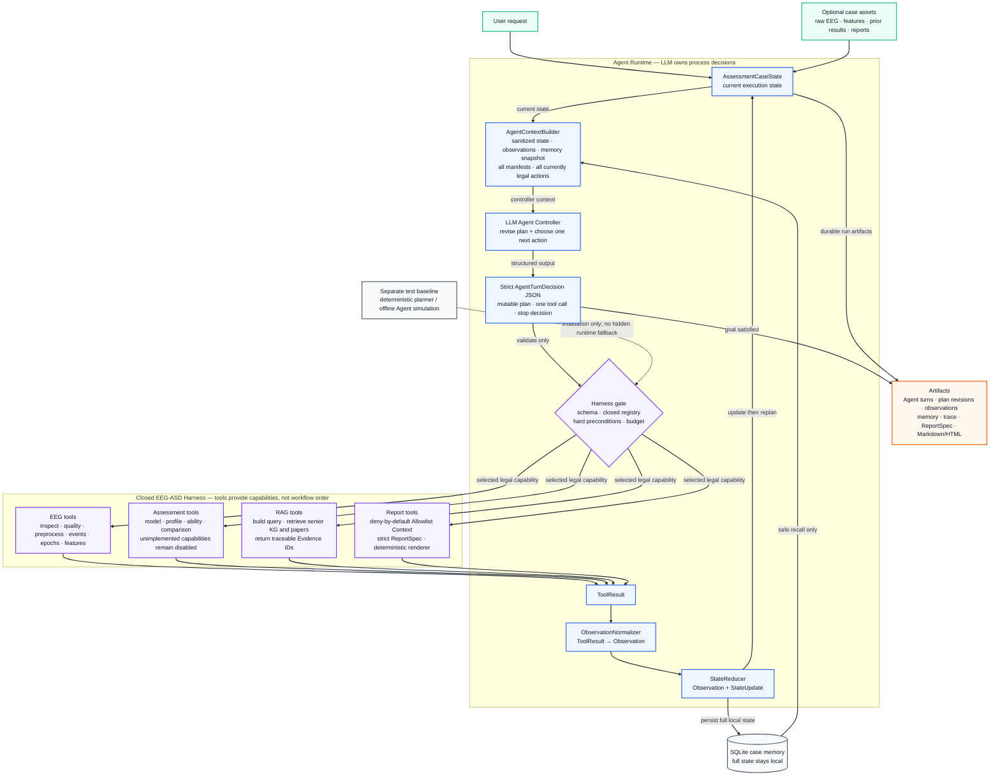

# Agentic Runtime Architecture

用户请求与可选资产进入统一 Case State；LLM 每轮修订计划并只选择一个动作，Harness 只验证和执行，Observation 更新状态后再次决策。

```mermaid
flowchart TB
    user["User request"]
    assets["Optional case assets<br/>raw EEG · features · prior results · reports"]

    subgraph runtime["Agent Runtime — LLM owns process decisions"]
        direction TB
        state["AssessmentCaseState<br/>current execution state"]
        context["AgentContextBuilder<br/>sanitized state · observations · memory snapshot<br/>all manifests · all currently legal actions"]
        controller["LLM Agent Controller<br/>revise plan + choose one next action"]
        decision["Strict AgentTurnDecision JSON<br/>mutable plan · one tool call · stop decision"]
        gate{"Harness gate<br/>schema · closed registry<br/>hard preconditions · budget"}
        result["ToolResult"]
        normalize["ObservationNormalizer<br/>ToolResult → Observation"]
        reduce["StateReducer<br/>Observation + StateUpdate"]

        state -->|"current state"| context
        context -->|"controller context"| controller
        controller -->|"structured output"| decision
        decision -->|"validate only"| gate
        result --> normalize
        normalize --> reduce
        reduce -->|"update then replan"| state
    end

    subgraph harness["Closed EEG-ASD Harness — tools provide capabilities, not workflow order"]
        direction TB
        eeg["EEG tools<br/>inspect · quality · preprocess · events · epochs · features"]
        assessment["Assessment tools<br/>model · profile · ability · comparison<br/>unimplemented capabilities remain disabled"]
        rag["RAG tools<br/>build query · retrieve senior KG and papers<br/>return traceable Evidence IDs"]
        report["Report tools<br/>deny-by-default Allowlist Context<br/>strict ReportSpec · deterministic renderer"]
    end

    memory[("SQLite case memory<br/>full state stays local")]
    outputs["Artifacts<br/>Agent turns · plan revisions · observations<br/>memory · trace · ReportSpec · Markdown/HTML"]
    baseline["Separate test baseline<br/>deterministic planner / offline Agent simulation"]

    user --> state
    assets --> state
    memory -->|"safe recall only"| context
    reduce -->|"persist full local state"| memory
    gate -->|"selected legal capability"| eeg
    gate -->|"selected legal capability"| assessment
    gate -->|"selected legal capability"| rag
    gate -->|"selected legal capability"| report
    eeg --> result
    assessment --> result
    rag --> result
    report --> result
    decision -->|"goal satisfied"| outputs
    state -->|"durable run artifacts"| outputs
    baseline -.->|"evaluation only; no hidden runtime fallback"| gate

    classDef input fill:#ECFDF5,stroke:#10B981,color:#111827,stroke-width:2px;
    classDef agent fill:#EFF6FF,stroke:#2563EB,color:#111827,stroke-width:2px;
    classDef harnessNode fill:#F5F3FF,stroke:#7C3AED,color:#111827,stroke-width:2px;
    classDef output fill:#FFF7ED,stroke:#EA580C,color:#111827,stroke-width:2px;
    classDef store fill:#F9FAFB,stroke:#4B5563,color:#111827,stroke-width:2px;
    class user,assets input;
    class state,context,controller,decision,result,normalize,reduce agent;
    class gate,eeg,assessment,rag,report harnessNode;
    class outputs output;
    class memory,baseline store;
    linkStyle default stroke:#1F2937,stroke-width:2px;
```
