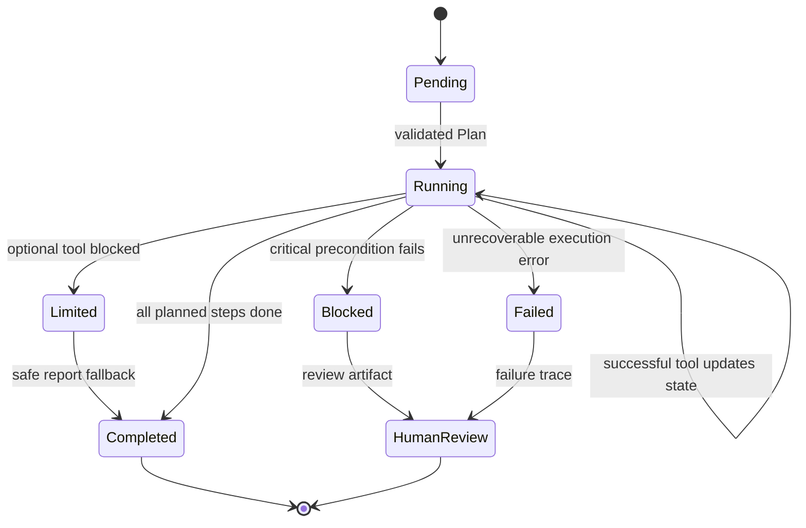

# Case State Transition

AssessmentCaseState 的主要执行状态变化。

```mermaid
stateDiagram-v2
    [*] --> Pending
    Pending --> Running: validated Plan
    Running --> Running: successful tool updates state
    Running --> Limited: optional tool blocked
    Running --> Blocked: critical precondition fails
    Running --> Failed: unrecoverable execution error
    Limited --> Completed: safe report fallback
    Running --> Completed: all planned steps done
    Blocked --> HumanReview: review artifact
    Failed --> HumanReview: failure trace
    Completed --> [*]
    HumanReview --> [*]
```
