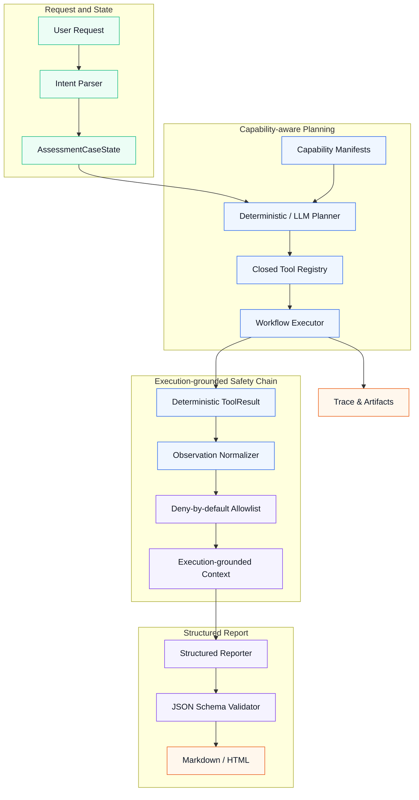

# Overall Architecture

EEG-ASD Workflow Agent 的端到端系统结构。

```mermaid
flowchart TB
    subgraph Request["Request and State"]
        U["User Request"] --> I["Intent Parser"] --> S["AssessmentCaseState"]
    end
    subgraph Planning["Capability-aware Planning"]
        S --> P["Deterministic / LLM Planner"]
        M["Capability Manifests"] --> P
        P --> R["Closed Tool Registry"] --> E["Workflow Executor"]
    end
    subgraph Safety["Execution-grounded Safety Chain"]
        E --> T["Deterministic ToolResult"] --> N["Observation Normalizer"]
        N --> A["Deny-by-default Allowlist"] --> C["Execution-grounded Context"]
    end
    subgraph Report["Structured Report"]
        C --> G["Structured Reporter"] --> V["JSON Schema Validator"]
        V --> O["Markdown / HTML"]
    end
    E --> X["Trace & Artifacts"]
    classDef input fill:#ECFDF5,stroke:#10B981,color:#111827;
    classDef core fill:#EFF6FF,stroke:#2563EB,color:#111827;
    classDef safety fill:#F5F3FF,stroke:#7C3AED,color:#111827;
    classDef output fill:#FFF7ED,stroke:#EA580C,color:#111827;
    class U,I,S input;
    class P,M,R,E,T,N core;
    class A,C,G,V safety;
    class O,X output;
```
