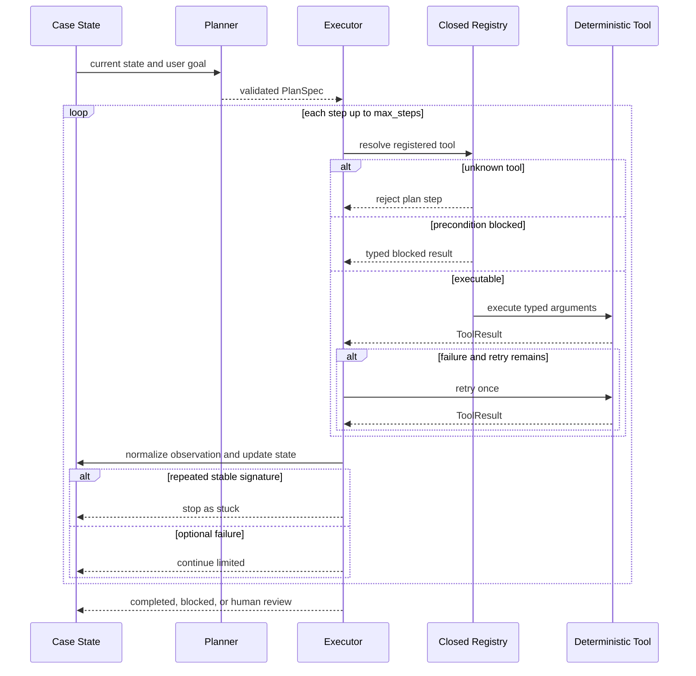

# ReAct Execution Loop

注册、前置条件、重试、停滞与有限降级的执行循环。

```mermaid
sequenceDiagram
    participant S as Case State
    participant P as Planner
    participant E as Executor
    participant R as Closed Registry
    participant T as Deterministic Tool
    S->>P: current state and user goal
    P-->>E: validated PlanSpec
    loop each step up to max_steps
        E->>R: resolve registered tool
        alt unknown tool
            R-->>E: reject plan step
        else precondition blocked
            R-->>E: typed blocked result
        else executable
            R->>T: execute typed arguments
            T-->>E: ToolResult
            alt failure and retry remains
                E->>T: retry once
                T-->>E: ToolResult
            end
        end
        E->>S: normalize observation and update state
        alt repeated stable signature
            E-->>S: stop as stuck
        else optional failure
            E-->>S: continue limited
        end
    end
    E-->>S: completed, blocked, or human review
```
