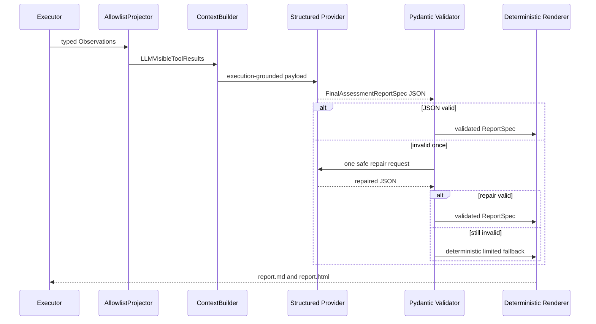

# Report Generation

严格 JSON、一次修复与确定性降级的报告序列。

```mermaid
sequenceDiagram
    participant E as Executor
    participant P as AllowlistProjector
    participant C as ContextBuilder
    participant L as Structured Provider
    participant V as Pydantic Validator
    participant R as Deterministic Renderer
    E->>P: typed Observations
    P->>C: LLMVisibleToolResults
    C->>L: execution-grounded payload
    L-->>V: FinalAssessmentReportSpec JSON
    alt JSON valid
        V->>R: validated ReportSpec
    else invalid once
        V->>L: one safe repair request
        L-->>V: repaired JSON
        alt repair valid
            V->>R: validated ReportSpec
        else still invalid
            V->>R: deterministic limited fallback
        end
    end
    R-->>E: report.md and report.html
```
