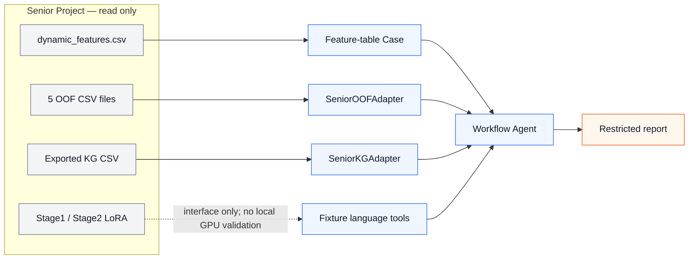

# Senior Project Integration

师兄特征、OOF、KG 与 LoRA 如何以只读受限方式接入。

```mermaid
flowchart LR
    subgraph Legacy["Senior Project — read only"]
        F["dynamic_features.csv"]
        O["5 OOF CSV files"]
        K["Exported KG CSV"]
        L["Stage1 / Stage2 LoRA"]
    end
    F --> C["Feature-table Case"]
    O --> A["SeniorOOFAdapter"]
    K --> G["SeniorKGAdapter"]
    L -. "interface only; no local GPU validation" .-> X["Fixture language tools"]
    C --> W["Workflow Agent"]
    A --> W
    G --> W
    X --> W
    W --> R["Restricted report"]
    classDef legacy fill:#F3F4F6,stroke:#6B7280,color:#111827;
    classDef adapter fill:#EFF6FF,stroke:#2563EB,color:#111827;
    classDef output fill:#FFF7ED,stroke:#EA580C,color:#111827;
    class F,O,K,L legacy;
    class C,A,G,X,W adapter;
    class R output;
```
